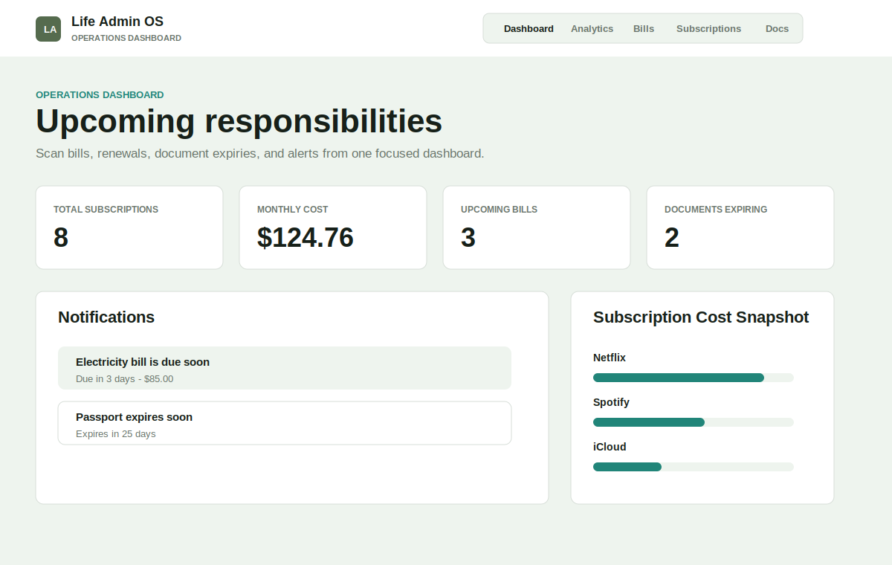
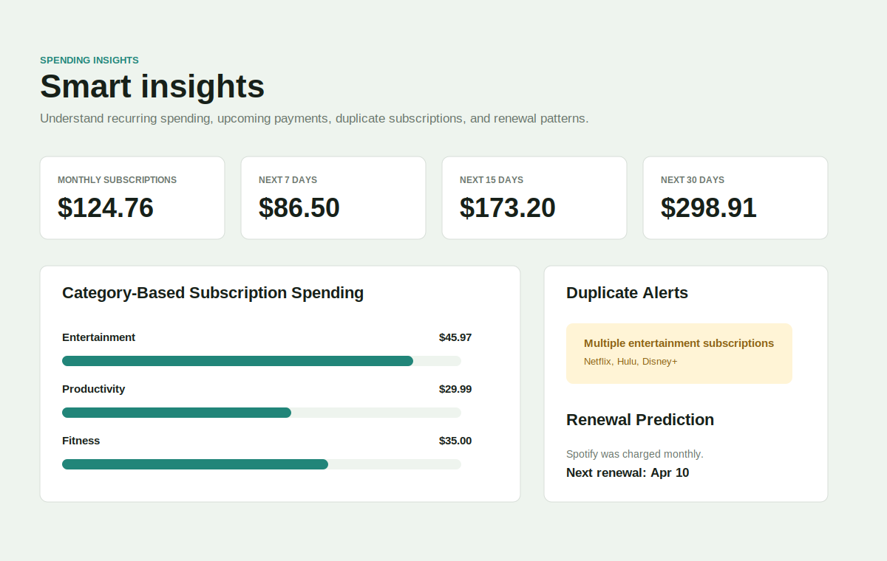
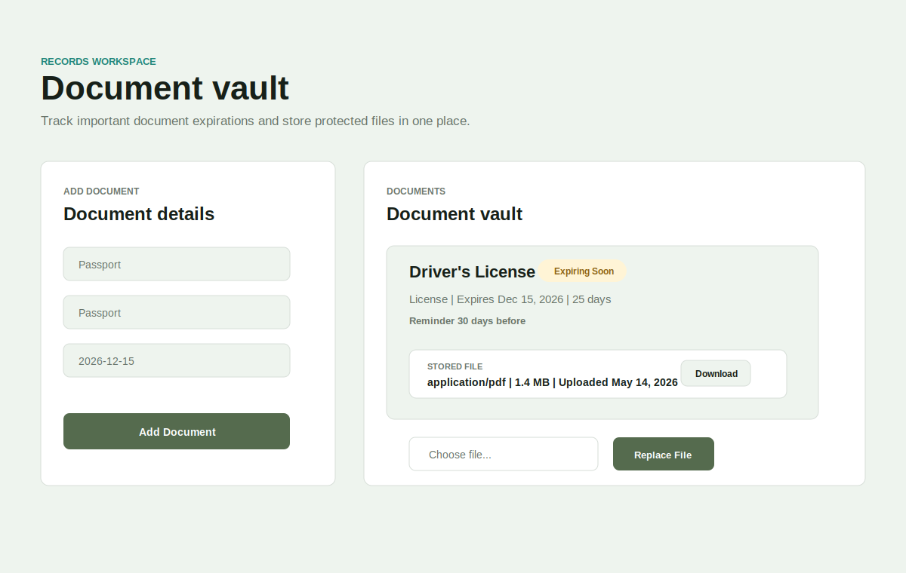

# Life Admin OS

Life Admin OS is a full-stack personal management dashboard for bills, subscriptions, document expirations, reminders, and recurring responsibilities. It starts with manual tracking and grows into an automation platform with Gmail detection, background jobs, notification delivery, document file storage, analytics, testing, and deployment setup.

## Portfolio Summary

Built a full-stack personal management dashboard that helps users track bills, subscriptions, document expiry dates, and reminders. Integrated Gmail-based detection, background job processing, document uploads, analytics, Google Calendar sync, and notification workflows to automate recurring life-admin tasks.

## Screenshots







## Features

- Secure account registration and JWT login.
- Protected dashboard with user-scoped data.
- Bill, subscription, and document CRUD.
- Document expiry statuses for valid, expiring soon, and expired records.
- PDF, JPG, and PNG document uploads with signed download links.
- In-app notifications with unread, read, and dismissed states.
- Reminder preferences for bills, subscriptions, and documents.
- Redis/BullMQ worker for reminder checks, Gmail scans, and notification delivery.
- Gmail OAuth and detected-item review workflow.
- Google Calendar event creation and SMTP email reminders.
- Analytics for monthly subscription spend, category spend, upcoming expenses, duplicate subscriptions, and renewal predictions.
- Rate limiting, structured logging, validation, and clean API errors.
- Automated backend and frontend tests.
- Production deployment setup for Docker, Render, Railway, Vercel, and Netlify.

## Tech Stack

Frontend:

- React
- React Router
- Vite
- Tailwind CSS

Backend:

- Node.js
- Express
- PostgreSQL
- JWT
- bcrypt
- BullMQ
- Redis
- Google APIs
- Multer

Infrastructure and tooling:

- Docker
- Render/Railway backend configs
- Vercel/Netlify frontend configs
- Node test runner

## Architecture

The system is split into three runtime services:

- Frontend: React single-page app for auth, dashboard, management pages, analytics, settings, and document vault interactions.
- Backend API: Express app that owns authentication, validation, CRUD APIs, Gmail OAuth, notifications, signed document access, and analytics.
- Worker: BullMQ worker that runs scheduled and heavy jobs outside the request path.

Supporting services:

- PostgreSQL stores users, bills, subscriptions, documents, notifications, Gmail connections, preferences, and detected items.
- Redis backs the job queue.
- Document storage uses a configurable storage directory today and is ready for an S3/Supabase/Cloudinary storage-driver upgrade.

See [docs/architecture.md](docs/architecture.md) for a deeper system walkthrough.

## Run Locally

Install dependencies:

```bash
npm install --prefix backend
npm install --prefix frontend
```

Start PostgreSQL and Redis:

```bash
docker compose up -d postgres redis
```

Create `.env` from `.env.example` and set at least:

```text
DATABASE_URL=
JWT_SECRET=
DOCUMENT_SIGNING_SECRET=
REDIS_URL=
```

Apply the schema:

```bash
psql "$DATABASE_URL" < database/schema.sql
```

Start the app:

```bash
npm run dev:backend
npm run dev:frontend
npm run worker
```

Open:

```text
http://localhost:5173
```

## Testing

Run the full automated suite:

```bash
npm test
```

Run deployment readiness checks:

```bash
npm run deploy:check
```

Current coverage includes backend validation, email parsing, API handlers, analytics, reminder generation, and frontend subscription cost calculations.

## Deployment

The repo includes:

- `backend/Dockerfile`
- `frontend/Dockerfile`
- `docker-compose.yml`
- `render.yaml`
- `railway.json`
- `vercel.json`
- `netlify.toml`

Production guide: [docs/DEPLOYMENT.md](docs/DEPLOYMENT.md)

## Project Structure

```text
Life_Admin_OS/
  backend/
    src/
      config/
      middleware/
      queues/
      routes/
      services/
      utils/
      workers/
    test/
  database/
    schema.sql
  docs/
    architecture.md
    api-design.md
    database-schema.md
    DEPLOYMENT.md
    TESTING.md
  frontend/
    src/
      api/
      components/
      hooks/
      pages/
      state/
      utils/
    test/
  screenshots/
  README.md
```

## Documentation

- [Project context](docs/PROJECT_CONTEXT.md)
- [Phase plan](docs/PHASE_PLAN.md)
- [Architecture](docs/architecture.md)
- [API design](docs/api-design.md)
- [Database schema](docs/database-schema.md)
- [Testing guide](docs/TESTING.md)
- [Deployment guide](docs/DEPLOYMENT.md)
- [Demo script](docs/demo-script.md)
- [Resume notes](docs/resume.md)

## Future Improvements

- Replace local document storage with S3, Supabase Storage, or Cloudinary.
- Add Playwright end-to-end tests for the core user journey.
- Add a production seed/demo account for portfolio walkthroughs.
- Add richer Gmail parsing with structured extraction and confidence explanations.
- Add exportable monthly reports.
- Add team or household sharing for shared bills and documents.
