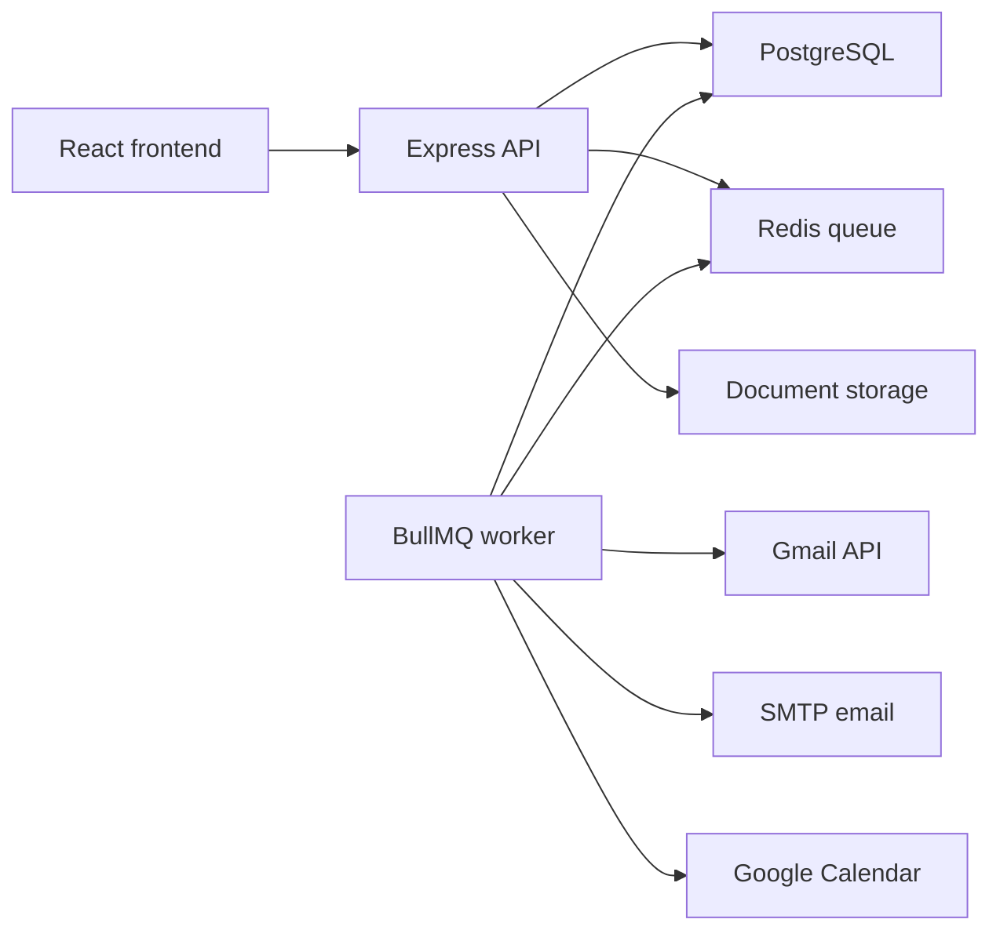

# Architecture

Life Admin OS is organized as a full-stack application with separate frontend, API, worker, database, Redis, and document-storage responsibilities.

## Runtime Components

## Frontend

The frontend is a React single-page app built with Vite and Tailwind CSS.

Main responsibilities:

- Registration and login screens.
- Protected dashboard.
- CRUD pages for bills, subscriptions, and documents.
- Document vault upload and download controls.
- Analytics and settings pages.
- API calls through a small fetch wrapper.

## Backend API

The backend is an Express API.

Main responsibilities:

- JWT authentication.
- Password hashing with bcrypt.
- User-scoped authorization for all owned records.
- Validation for emails, UUIDs, dates, amounts, reminder values, and file uploads.
- CRUD APIs for bills, subscriptions, documents, notifications, detected items, and preferences.
- Gmail OAuth connection flow.
- Signed document download URLs.
- Analytics summaries.
- Rate limiting and structured logging.

## Worker

The worker runs separately from the API service so slow or scheduled work does not block web requests.

Worker jobs:

- `check-upcoming-reminders`
- `scan-user-email`
- `send-notification`

## Data Flow Examples

Bill reminder:

1. User creates a bill with a due date and reminder preference.
2. Worker runs the reminder check job.
3. Backend inserts a notification if the reminder window is active.
4. User sees the notification in the dashboard.
5. Worker can send email or create a calendar event based on preferences.

Gmail detection:

1. User connects Gmail through OAuth.
2. API stores the connection tokens.
3. User starts a scan.
4. Worker scans recent Gmail messages.
5. Parser creates pending detected items.
6. User confirms, edits, or ignores each detected item.

Document vault:

1. User creates document metadata.
2. User uploads a PDF, JPG, or PNG.
3. API validates file type and size.
4. API stores file metadata and storage key.
5. User requests a download URL.
6. API returns a short-lived signed link.

## Production Shape

Recommended deployment:

- Frontend on Vercel or Netlify.
- API on Render, Railway, Fly.io, or EC2.
- Worker as a separate background process.
- PostgreSQL on Neon, Supabase, or RDS.
- Redis on Upstash, Redis Cloud, Railway, or Render.
- Document storage on persistent disk now, S3-compatible storage later.
